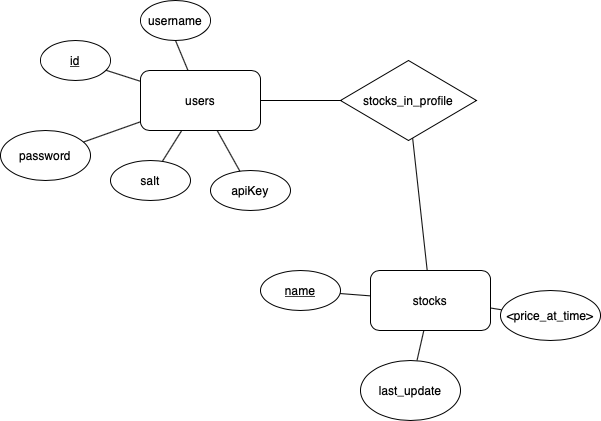

# Forecaster
Forecaster API gives you only the most necessary information you need for your day to day stock Protfolio!

Welcome to  Forecaster!

Forecaster is a restful api service designed by developer to developers.

You can select your favourite stocks and get daily updates on their Price change, average weekly price, historical prices, min-max, and (soon-to-add) Forecasted Prediction!

**Database Schema**

Prerequisites
    
    curl
    docker -> up and running
    cassandra -> up and running @ port 9042
Setup

    docker build -t forecaster:v1 . && docker run -p 80:80 forecaster:v1

How to use Forecaster:

* **Step 1.**

Sign up! Its really easy, just send a post request to this website using your username and selected password. You will be given an API key... keep it a secret thought  shhhhh!!! 

ex: 

    curl -i -H "Content-Type: application/json" -X POST -d '{"username":"John Smith","password":"Secret123"}' http://forcaster/login

 

* **Step 2.**

Add your favourite stocks or delete (-X DELETE) them to keep track of... Google, Apple, DowJones, Go.Ku Inc, NASDAQ etc.

ex:

    curl -i -H "x-access-req: <APIkey>" -H "Content-Type: application/json" -X POST -d '{"stockName":"AAPL"}' http://forecaster/profile/edit

 

* **Step 3.**

Start making calls to get your stock infromation. Just make sure to put your api-key as follows into the get request. You can also put a startDate and/or a endDate. This request will generate a json with: maxPrice, minPrice, AverageWeeklyPrice, currentPrice.

ex:

    http:/forecaster/stock/AAPL?apiKey=<APIkey>&startDate=2018-01-01

* **Step 4.**

Hate numbers like graphics? No problem, we'll return you a graph image 

ex:

    http://forecaster/stock/chart/AAPL?apiKey=<APIkey>

* **Step 5.**

You can also have a look at your portolio. The following will return a json list of your favourite stocks.

ex:

    http://forecaster/profile?apiKey=<APIkey>

**Known Issues**

Cassandra may be running on other ports rather than specified in the DbCommunicator, check the ip address
where its running in case of crash.
In case db is not initialized, initialize it in cqlsh by copy pasting the code provided in initDB.

**Future Work**

Using more resources adn reliable API, implement the Forecast function, to return a predicted price
of the stock to the user.

Enjoy!
